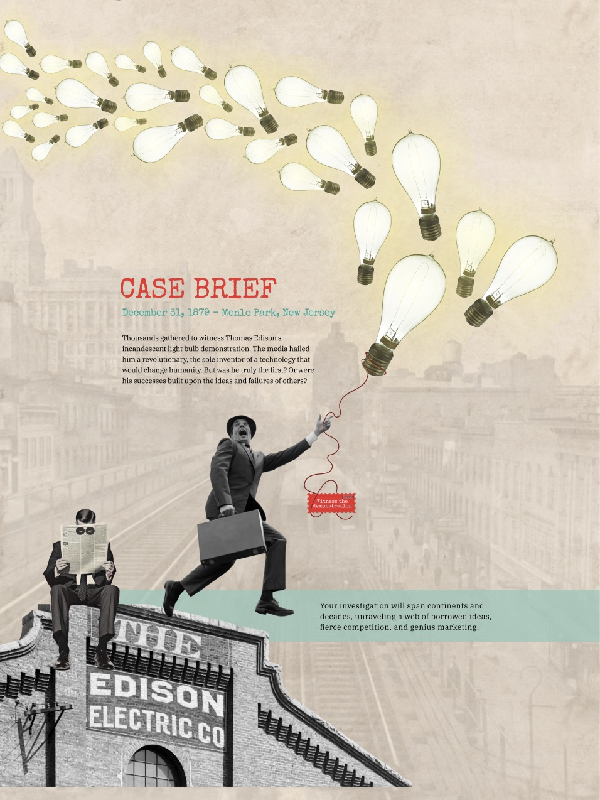

# Edison Myth Fact-Check – Portfolio Project

## Assignment Description
This project was created as a **storytelling and web design assignment**, where the goal was to craft a **scrollytelling, interactive webpage** that challenges commonly held beliefs. The assignment focused on blending historical research, design, and narrative to create an **engaging, educational digital experience**.

---

## Preview
The design can be explored in the Figma file here:  
[Figma Design – Edison Myth Fact-Check](https://www.figma.com/proto/HAUwTQves6q7JkTDoSGdFL/Storytelling_website?page-id=16%3A9&node-id=979-17863&viewport=-4262%2C148%2C0.07&t=H8tDYqlHvA1VlpAk-1&scaling=min-zoom&content-scaling=fixed&starting-point-node-id=341%3A129599)
[Figma Work File – Edison Myth Fact-Check](https://www.figma.com/design/HAUwTQves6q7JkTDoSGdFL/Storytelling_website?node-id=16-9&t=pYoiskt33Pwp9F6h-1)
---

## Overview
The **Edison Myth Fact-Check** is an interactive, scrollytelling webpage that investigates the misconception that Thomas Edison invented the light bulb alone. Visitors take on the role of a detective, uncovering clues, historical facts, and the global network of innovators who contributed to the invention.

---

## My Approach
For this storytelling project, I wanted to go far beyond a simple timeline or fact sheet. I set out to design a **visual investigation** that immerses visitors in a detective story, encouraging them to question what they think they know. The site blends historical fact, pop-culture myth, and web interaction into a dynamic scrollytelling experience.

### Concept Development
I chose the “Edison didn’t invent the light bulb” misconception because it’s familiar yet complex—it’s about **how stories shape our understanding of innovation**. Framing the site as a “declassified case file,” I invited users to take on the role of detective, following red threads, magnifying clues, and tracking the global relay of invention.  

### Visual & Graphic Language

The visual style draws inspiration from **vintage investigative journalism**:  
- **Collage textures** and hand-illustrated lines guide the eye from clue to clue.  
- **Stamped typewriter fonts** evoke old case files.  
- **Color-pop callouts** highlight evidence and key facts.  
- Graphics are either **hand-illustrated or remixed from historical archives**, ensuring originality and a strong connection to the content.  
- Layout, color, and composition echo the feel of secret dossiers and detective thrillers, giving each scroll a sense of discovery and drama.

### Process & Structure
1. **Story Mapping:** Sections were structured as clue-driven chapters: context, myth, global collaborators, money trail, and myth-busting conclusion.  
2. **Interaction Brainstorming:** Considered hoverable clues, animated evidence trails, branching timelines, and dynamic number reveals.  
3. **Sketches & Styleboards:** Created rough layouts and styleboards before building high-fidelity prototypes in Figma.  
4. **Balancing Narrative & Design:** Ensured visuals and interactions guide visitors from the **emotional hook** into deeper historical facts, emphasizing critical thinking.  

### Typography & Layout
Typography combines **typewriter-inspired fonts** with readable modern text, supporting the detective dossier aesthetic. Layouts are designed to encourage **curiosity and engagement**, balancing legibility with the playful sense of discovery.

---

## Outcome
The final product is a **one-page interactive experience** that blends fact-checking, history, and storytelling. Visitors are encouraged to question commonly held myths, explore the global network of innovation, and enjoy a memorable, playful, and informative digital experience.

---

## Tools & Techniques
- **Design & Prototyping:** Figma  
- **Illustration:** Hand-drawn sketches digitized and integrated into the page  
- **Typography:** Vintage typewriter-inspired fonts for dossier feel  
- **UX & Layout:** Narrative-driven scrollytelling, clue-based interaction, engaging visual hierarchy

