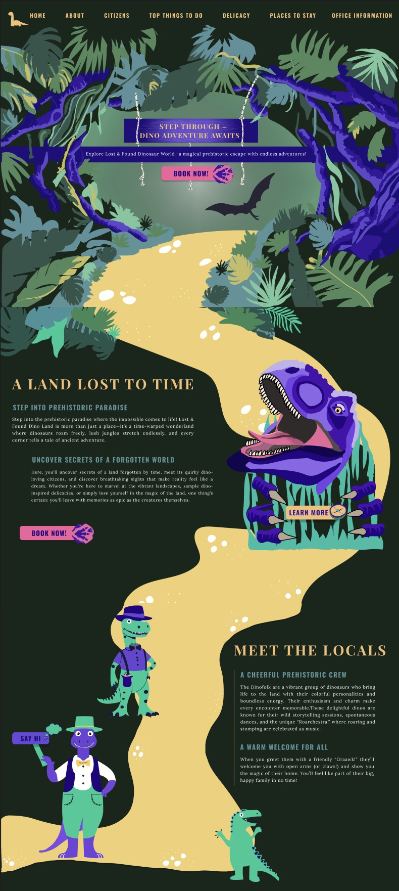

# Land of Lost & Found

## Assignment Description
This project was created as part of a web design assignment focused on crafting a **unique, narrative-driven homepage**. The goal was to design a website that breaks away from conventional layouts and templates, immersing visitors in a **fantastical, playful world**. The assignment encouraged a mix of hand-drawn illustrations and digital design, with emphasis on storytelling, interactivity, and a cohesive visual language.

---

## Preview
The design can be explored in the Figma file here:  
[Figma Design – Land of Lost & Found](https://www.figma.com/file/yourfilelink)

---

## Overview

**Land of Lost & Found** is a narrative-driven website where forgotten things come alive. Visitors encounter quirky characters, playful surprises, and a joyful, offbeat digital landscape designed to break free from conventional web templates.

---

## My Approach
Designing for the “Land of Lost & Found” was an opportunity to invent something completely original. I approached this project as both a **storyteller and a designer**, aiming to create a digital experience that feels like exploring a hidden, magical land.  

### Visual Brainstorming
I began by immersing myself in the brief and collecting inspiration from sources that celebrated the unexpected: **illustrated children’s books, retro theme park posters, and playful travel editorials**. My goal was to develop a visual language that immediately signals a world of joy, surprise, and narrative depth.

### Concept Development
Every homepage section was treated like a miniature story scene. I imagined visitors wandering through a quirky theme park where dinosaurs wear bow ties, pizzas erupt like volcanoes, and locals are more cartoon than citizen.  

- **Must-Eat, Must-See, Must-Stay:** Each section became a “mini-world,” packed with illustrations and playful interactions to guide the user through the story.  
- **Character Design:** Citizens were created with distinct personalities and quirks to add humor and charm while helping guide visitors.  
- **Interactive Elements:** CTAs like “Book Now!” or small reveals were integrated to reward curiosity and exploration.

### Experimentation & Iteration
To avoid rigid, template-like layouts, I experimented extensively with:  
- **Floating navigation and overlapping layers** to create a sense of depth.  
- **Winding visual paths** to encourage scrolling as a discovery journey.  
- **Organic, wavy shapes** to make every corner of the page feel alive and energetic.  

I sketched extensively in Figma, constantly refining layouts, compositions, and color palettes. Feedback loops included self-review and peer critique, which helped me improve legibility while keeping the design whimsical.  

### Balancing Hand-Drawn and Digital
All graphics were created with a **blend of hand-drawn and digital techniques**, giving the site a collage-like, dynamic feel. This approach ensured that every section maintained a cohesive style while still allowing individual elements to stand out and delight the user.

### Typography & Color
Typography choices reflect an adventurous, playful tone, balancing bold, friendly headlines with readable body text. The color palette was chosen to feel energetic, imaginative, and joyful, supporting the fantastical narrative of the site.

---

## Structure & Usability
- Avoided conventional boxy layouts in favor of **visual layering, depth, and playful paths**.  
- Sections are designed as micro-worlds, with clear guidance for users while maintaining a sense of discovery.  
- Interactivity is subtle but rewarding, encouraging exploration and engagement.

---

## Result
The homepage acts as a **digital invitation to a world where nothing is wasted, and everything has a story**. Visitors leave with memories of a country that doesn’t exist—quirky, joyful, and full of delightful surprises.

---

## Tools & Techniques
- **Design & Prototyping:** Figma  
- **Illustration:** Hand-drawn sketches digitized in Adobe Illustrator  
- **Typography:** Custom selection to match playful and adventurous themes  
- **UX & Layout:** Narrative-driven, story-first approach, playful visual hierarchy
---
## Process & Documentation
- **Figma Process File:** [Link to Figma – Ideation, Brainstorm, Reflection, UX Decisions](https://www.figma.com/design/IThdYmRxxnNfU0OrFgg94r/workshop-booking-final-design?node-id=84-30&t=xTXSIiDWMo7xxuIN-1) 
- **Figma Design File:** [Link to Figma – Visual Style, Moodboards, UI Design]  (https://www.figma.com/design/gigjdtwoJ1IxRBvc6wHLmn/not-so-glichy-worhshop?node-id=57-92684&t=ABpu3SBXqXTvc9fD-1)